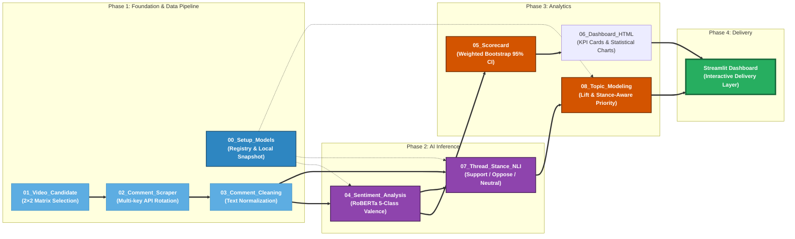

# Brand Crisis Attribution Engine: Strategic Sentiment & Resonance Analytics

## Live Interactive Dashboard
[Explore the Dashboard](https://brand-crisis-attribution-engine-8cdyn2v5ymytewbxdrlybc.streamlit.app/)

## Portfolio Deliverables
- **Business Report (PDF):** `reports/Changyu_BrandCrisis_Analytics_Portfolio.pdf`
- **Interactive Dashboard:** Streamlit app above
- **Code & Notebooks:** current repository

## Dashboard Preview


---

## Project Overview
This project is an end-to-end NLP analytics pipeline for diagnosing brand crises on social media. Using **Shein’s labor controversy** as a case study, the project applies a **2×2 comparative design**—target brand vs. peers, crisis topic vs. neutral topic—to move from raw YouTube comments to business-facing outputs such as:

- **macro risk validation**
- **high-risk topic identification**
- **brand-specific attribution analysis**
- **discussion escalation diagnosis**
- **response prioritization**

Rather than stopping at sentiment description, this project focuses on a more decision-oriented question:

> **Which risks are merely noisy, and which are both amplifiable and likely to be stably attributed to the brand?**

The full business-facing write-up is available in the report:  
`reports/Changyu_BrandCrisis_Analytics_Portfolio.pdf`

---

## Key Findings
- **Shein-related labor discussions show materially higher composite risk** than benchmark comparison cells, indicating a real crisis increment rather than isolated negative noise.
- **Topic-level analysis identifies high-risk themes** in labor exploitation, purchase refusal/rationalization, influencer backlash, and fast-fashion value conflict.
- **High-risk topics tend to have scarce supportive voices and stronger adversarial structures**, suggesting that evidence-led response materials, third-party validation, and FAQ-based content supply are more effective than direct confrontation.

---

## Analytical Framework
This project extends beyond traditional sentiment analysis by separating four business-relevant layers:

- **Impact**  
  Which topics are both negative and amplifiable?

- **Attribution**  
  Which risks are more brand-specific than industry-generic?

- **Dynamics**  
  Do discussions evolve through resonance, or through confrontation and polarization?

- **Priority**  
  Which topics should be addressed first based on combined risk signals?

This framework aligns the technical pipeline with the structure of the final report: from **macro validation**, to **topic-level risk mapping**, to **escalation mechanism**, and finally **action prioritization**.

---

## What the Pipeline Produces
The repository exports interactive topic-level and dashboard outputs, including:

- **Topic Bubble Landscape**  
  Topic Net Negative × Topic Amplification

- **Lift Ranking Bar Chart**  
  Topics most attributable to the brand cell

- **Priority Ranking**  
  Stance-aware topic priority based on negativity, amplification, resonance strength, controversy, and topic volume

- **Attribution Risk Matrix**  
  Lift × Priority, with controversy and topic heat layered into the visualization

- **NLI Stance Distribution**  
  Support / Oppose / Neutral structure for thread-level escalation diagnosis

These outputs support the report’s core questions:
1. Is the crisis structurally more negative than baseline?
2. Which topics are most likely to spread?
3. Which topics are most likely to be remembered as “Shein-specific”?
4. Why are some discussions more likely to escalate?
5. What should the brand address first?

---

## End-to-End Pipeline


---

## Repository Structure
- `Notebooks/` — pipeline notebooks (`00–08`) in recommended run order
- `configs/` — YouTube search config, cleaning lexicon, model registry/lock
- `Data/` — timestamped run outputs from raw scraping to analytics outputs
- `app_data/` — exported HTML charts and CSV tables used by the dashboard
- `reports/` — business-facing project report and portfolio artifacts
- `models/` — local model snapshots for offline reproducibility (not recommended for GitHub)

---

## Notebook Pipeline

### `00_setup_models.ipynb`
Downloads and pins model snapshots for offline-ready execution.

### `01_youtube_video_candidate.ipynb`
Builds the 2×2 comparison matrix and exports candidate videos for review.

### `02_comment_scraper.ipynb`
Scrapes top-level comments and replies with multi-key quota rotation and thread construction.

### `03_comment_cleaning.ipynb`
Performs text normalization and produces model-ready and display-ready text fields.

### `04_sentiment_analysis.ipynb`
Runs 5-class valence prediction and outputs sentiment-ready comment files.

### `05_scorecard.ipynb`
Aggregates video-level metrics and estimates uncertainty using weighted bootstrap.

### `06_dashboard_html.ipynb`
Builds HTML charts and KPI visuals for macro comparison and dashboard delivery.

### `07_thread_stance_nli.ipynb`
Runs zero-shot NLI to infer reply stance vs. parent comment and calculates resonance / controversy.

### `08_topic_modeling.ipynb`
Performs topic clustering, Lift attribution, and stance-aware priority ranking.

---

## How to Run

### 1. Create environment and install dependencies
```bash
python -m venv .venv
# activate your virtual environment
pip install -r requirements.txt
```

### 2. Configure
- Edit `configs/youtube_search.yaml`
- Optional: edit `configs/cleaning_lexicon.yaml`
- Optional: edit `configs/model_registry.yaml`

### 3. Download models
Run:

- `Notebooks/00_setup_models.ipynb`

### 4. Run the pipeline in order
Run notebooks from `01` to `08`.  
Each stage writes a timestamped output folder under `Data/`.

---

## Report
The business-facing report for this project is available at:

- `reports/Changyu_BrandCrisis_Analytics_Portfolio.pdf`

It includes:
- business background and research question
- 2×2 study design
- macro risk validation
- topic-level risk mapping
- brand-specific attribution analysis
- escalation mechanism diagnosis
- action prioritization and strategy recommendations
- appendix with metric dictionary, cleaning rules, and model/tool notes

---

## Reproducibility Notes
- Each run writes to `Data/data_XX_*` folders with timestamps
- Model snapshots can be pinned via config registry and lockfile
- The repo is structured to support traceability from raw comments to final charts

---

## Privacy & Compliance
- Do not commit raw scraped comments if platform policy or repo size is a concern
- Store API keys locally and exclude them from git
- Prefer `.env` and `.gitignore` for secrets and local credentials

---

## License
Add an MIT License if you want to make this portfolio project publicly reusable.

