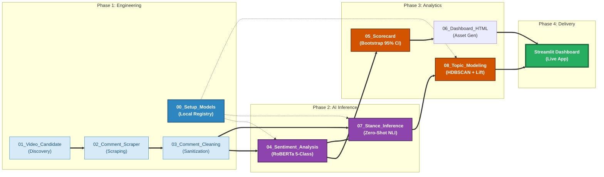

YouTube Comment Sentiment Analysis — Risk, Resonance & Topic Attribution

Live Interactive Dashboard: [Explore the Analysis Results Here](https://brand-crisis-attribution-engine-8cdyn2v5ymytewbxdrlybc.streamlit.app/)

Project Overview
This project is an industrial-grade, end-to-end NLP analytics pipeline designed to dissect brand crises on social media. Using Shein's "Modern Slavery" controversy as a case study, the engine transforms thousands of raw YouTube comments into high-dimensional business intelligence.
Unlike traditional sentiment tools, this pipeline quantifies Resonance (alignment), Controversy (polarization), and Topic Lift (brand-specific risk) using state-of-the-art LLM techniques including NLI Stance Detection and HDBSCAN Clustering.

- Collect top-level comments and replies by video query
- Clean and normalize text
- Run 5-class sentiment/valence scoring
- Build scorecards with bootstrap uncertainty
- Estimate reply stance using NLI to quantify resonance and controversy
- Topic modeling + attribution (Lift) to identify brand-specific risk drivers
- Export interactive dashboards (Plotly HTML)

Key idea (why this is more than sentiment)
Negative volume is not enough. This pipeline separates:
1) Attribution: which topics over-index in the target brand cell (Lift)
2) Impact: how negative and how amplified a topic is (engagement)
3) Dynamics: whether the thread is aligned (resonance) or polarizing (controversy)
4) Priority: a stance-aware “destructiveness” score (z-score fusion)

Outputs include 4 interactive topic visuals:
- Topic bubble landscape (net negative × amplification; color = Lift; hover = stance)
- Lift ranking bar chart (topics most attributable to brand cell)
- Priority ranking bar chart (stance-aware destructiveness)
- Attribution risk matrix (Lift × Priority; size = heat; color = controversy)

Repository structure
- Notebooks/: pipeline notebooks (00–08), recommended run order
- configs/: YAML configs (YouTube search, cleaning lexicon, model registry/lock)
- Data/: timestamped run outputs (raw -> cleaned -> sentiment -> scorecard -> stance -> topic modeling)
- app_data/: exported HTML charts and CSV tables used by the dashboard
- models/: local model snapshots for offline runs (not recommended to commit to GitHub)

Notebook pipeline (run order)
00_setup_models.ipynb
- Downloads and pins model snapshots into models/ for offline repeatability

01_youtube_video_candidate.ipynb
- Finds candidate videos via YouTube search config and exports CSVs for review

02_comment_scraper.ipynb
- Scrapes top-level comments + replies and builds thread-level artifacts

03_comment_cleaning.ipynb
- Cleans and normalizes text; outputs cleaned top-level and replies

04_sentiment_analysis.ipynb
- Runs 5-class sentiment/valence scoring; outputs sentiment5_top_level.parquet

05_scorecard.ipynb
- Aggregates scorecard metrics + bootstrap uncertainty; exports summary tables

06_dashboard_html.ipynb
- Generates HTML dashboards and KPI visuals

07_thread_stance_nli.ipynb
- Runs NLI stance for replies vs parent; outputs thread-level resonance/controversy

08_topic_modeling.ipynb
- Topic modeling + Lift attribution + stance-aware priority risk; exports 4 interactive charts

How to run (quickstart)
1) Create environment and install dependencies
- python -m venv .venv
- activate the venv
- pip install -r requirements.txt

2) Configure
- Edit configs/youtube_search.yaml (query terms, constraints)
- Optional: configs/cleaning_lexicon.yaml
- Optional: configs/model_registry.yaml (HF endpoint, runtime profile)

3) Download models (offline-ready)
- Run Notebooks/00_setup_models.ipynb

4) Run notebooks 01 -> 08 in order
- Each stage writes a timestamped folder under Data/

Dashboard / results
- Interactive Plotly HTML exports are saved under app_data/ and the latest Data/data_06_* / Data/data_08_* folders
- Open the HTML files directly in a browser:
  01_topic_bubble_netneg_x_amp.html
  02_topic_lift_bar_primary.html
  03_priority_ranking_stance_aware.html
  04_attribution_risk_matrix.html

Reproducibility notes
- Each run writes into Data/data_XX_* with timestamps for traceability
- Model snapshots can be pinned using registry + lockfile under configs/

Privacy & compliance
- Do not commit raw scraped comments if you need to keep the repo lightweight or comply with platform policies
- Store API keys locally and exclude them from git (use .env and .gitignore)

License
- Add an MIT LICENSE (recommended for portfolio projects)
